# RED: Residual Estimation Diffusion for Low-Dose PET Sinogram Reconstruction
[](https://arxiv.org/abs/2411.05354)
[](https://opensource.org/licenses/MIT)
This repository contains the PyTorch implementation of the paper **"RED: Residual Estimation Diffusion for Low-Dose PET Sinogram Reconstruction"**.
> **Code Availability:** The source code is available at [https://github.com/yqx7150/RED](https://github.com/yqx7150/RED).

## Abstract
Recent advances in diffusion models have demonstrated exceptional performance in generative tasks across various fields. In positron emission tomography (PET), the reduction in tracer dose leads to information loss in sinograms. Using diffusion models to reconstruct missing information can improve imaging quality. Traditional diffusion models effectively use Gaussian noise for image reconstructions. However, in low-dose PET reconstruction, Gaussian noise can worsen the already sparse data by introducing artifacts and inconsistencies. To address this issue, we propose a diffusion model named residual estimation diffusion (RED). From the perspective of diffusion mechanism, RED uses the residual between sinograms to replace Gaussian noise in diffusion process, respectively sets the low-dose and full-dose sinograms as the starting point and endpoint of reconstruction. This mechanism helps preserve the original information in the low-dose sinogram, thereby enhancing reconstruction reliability. From the perspective of data consistency, RED introduces a drift correction strategy to reduce accumulated prediction errors during the reverse process. Calibrating the intermediate results of reverse iterations helps maintain the data consistency and enhances the stability of reconstruction process. Experimental results show that RED effectively improves the quality of low-dose sinograms as well as the reconstruction results. 

## Preliminary
<p align="center">
  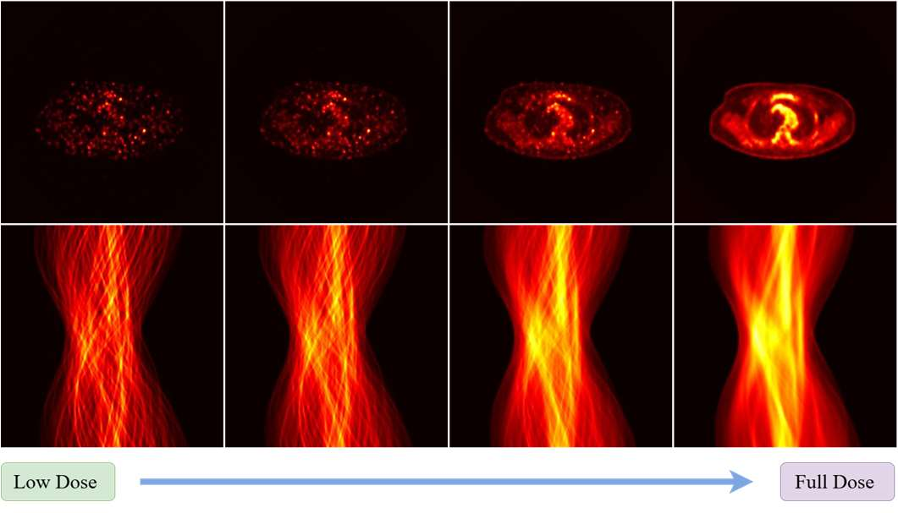
  <br>
  <em>Figure 1: The low-dose data (left) has worse quality compared to the full-dose data (right). Graininess and discontinuities increase as the lines in the sinogram become sparser in the projection domain</em>
</p>


## Method Overview

<p align="center">
  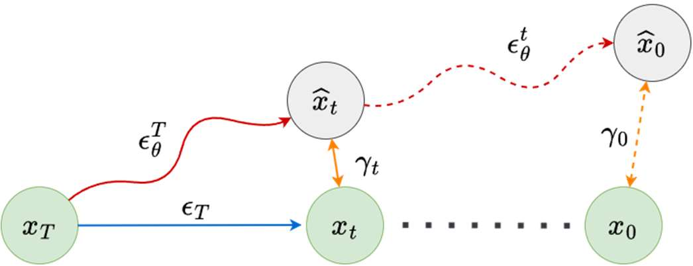
  <br>
  <em>Figure 2:  Illustration of data drift in the reverse process. Drift 𝛾௧ accumulates due to the imperfect prediction of residual, leading the final reconstruction result to deviate from expectations.</em>
</p>

<p align="center">
  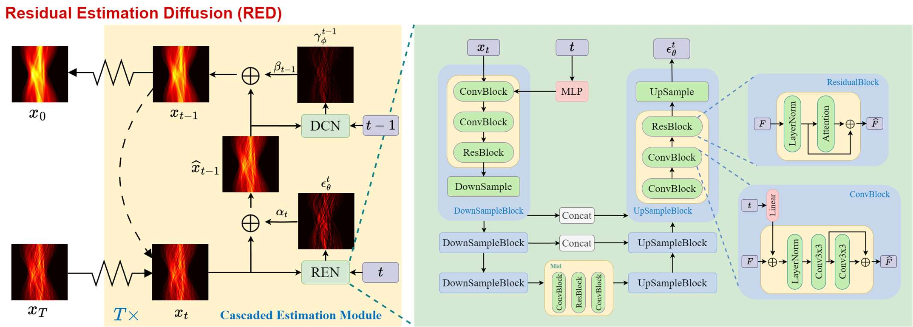
  <br>
  <em>Figure 3: The overall structure of RED. During the reverse process, CEM first estimates the residual to calculate 𝑥ො୲ିଵ , then corrects it to prevent excessive drift. Both REN and DCN use the same network architecture.</em>
</p>


## Results
<p align="center">
  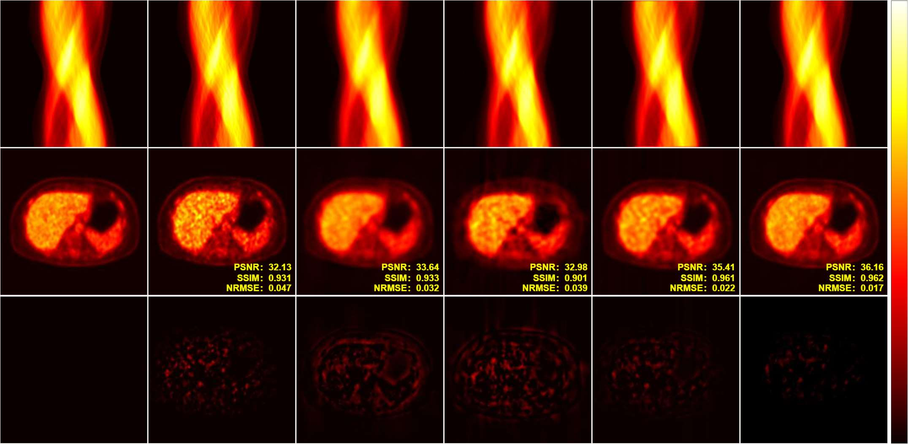
  <br>
  <em>Figure 4: Comparison of reconstruction under DRF 4 using different methods. The first row illustrates the sinograms, the second row presents the reconstruction results, and the last row displays the residuals.</em>
</p>

<p align="center">
  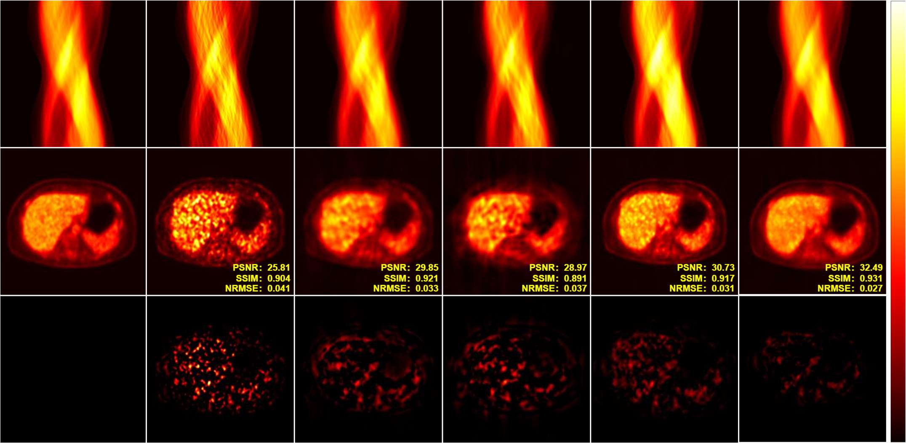
  <br>
  <em>Figure 5: Comparison of reconstruction under DRF 20 using different methods. The first row illustrates the sinograms, the second row presents the reconstruction results, and the last row displays the residuals.</em>
</p>

<p align="center">
  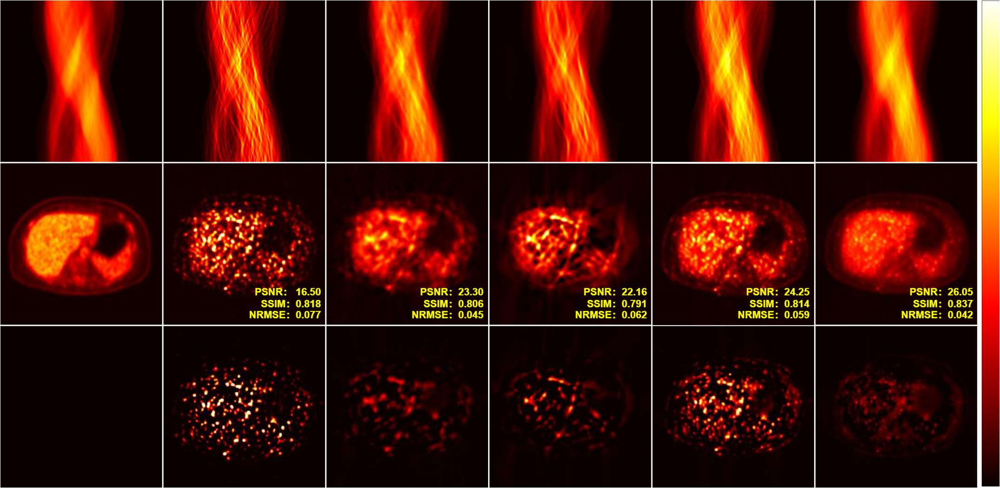
  <br>
  <em>Figure 6: Comparison of reconstruction under DRF 100 using different methods. The first row illustrates the sinograms, the second row presents the reconstruction results, and the last row displays the residuals.</em>
</p>

<p align="center">
  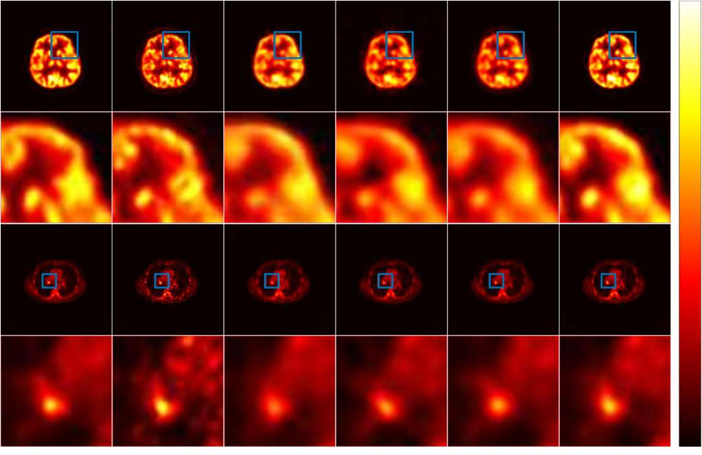
  <br>
  <em>Figure 7: The illustration of the brain and lung regions under DRF 20. RED preserves more details while also producing smoother results.</em>
</p>

<p align="center">
  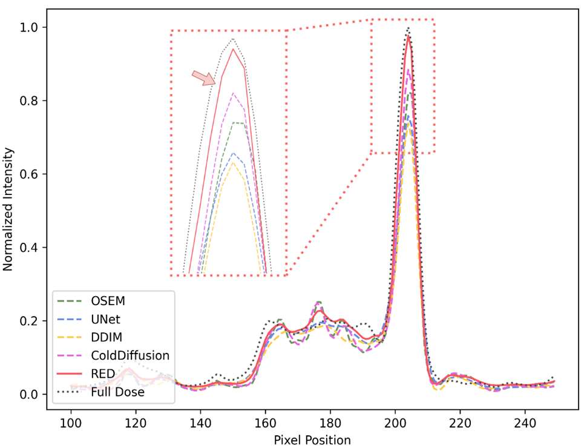
  <br>
  <em>Figure 8:The profile lines of each model after normalization show that the recovery values of RED are closest to the real data.</em>
</p>

<p align="center">
  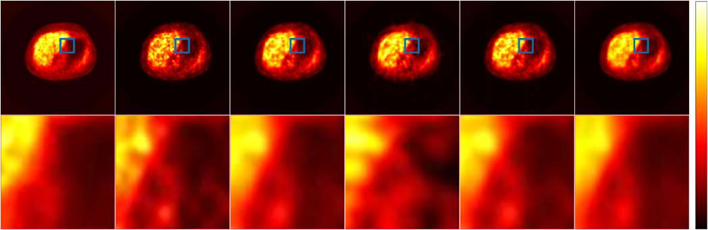
  <br>
  <em>Figure 9: Comparison of the reconstruction results under DRF 20 using different methods. The first row shows the sinograms used for reconstruction, and the second row is the reconstruction results.</em>
</p>

<p align="center">
  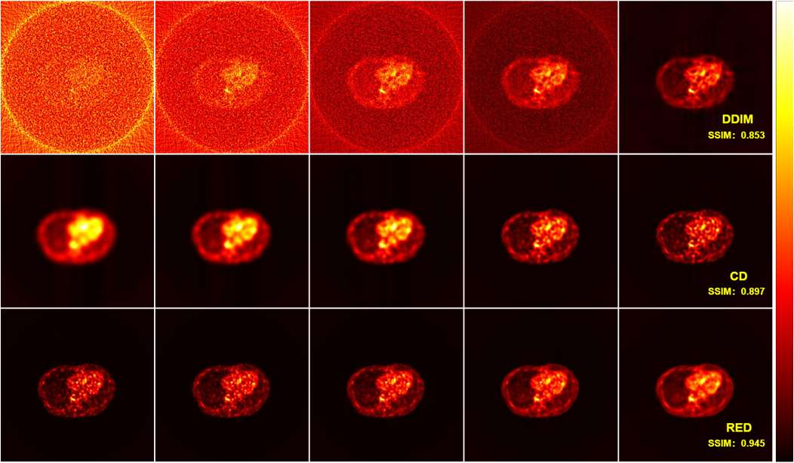
  <br>
  <em>Figure 10: Comparison of the reverse process under DRF 20 using different diffusion mechanisms.</em>
</p>

<p align="center">
  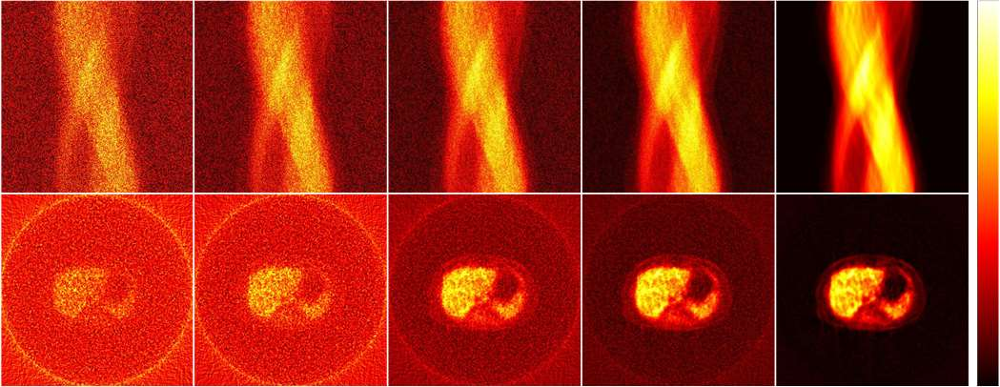
  <br>
  <em>Figure 11: The intermediate results of RED after adding Gaussian noise to inputs. RED effectively removes the added noise during the iterative process.</em>
</p>


## Citation
```bibtex
If you use this code or find our work useful, please cite:
@article{ai2024red,
  title={RED: Residual Estimation Diffusion for Low-Dose PET Sinogram Reconstruction},
  author={Ai, Xingyu and Huang, Bin and Chen, Fang and Shi, Liu and Li, Binxuan and Wang, Shaoyu and Liu, Qiegen},
  journal={arXiv preprint arXiv:2411.05354},
  year={2024}
}
